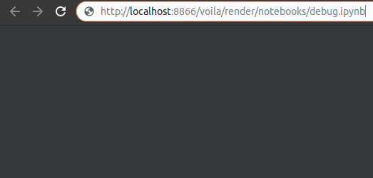

# voila-debug

A template to show debug information when working on voila applications.



## Installation

```
pip install voila-debug
```

## Usage

```
voila --template=debug --VoilaExporter.template_file=debug.tpl
```

## License

We use a shared copyright model that enables all contributors to maintain the
copyright on their contributions.

This software is licensed under the BSD-3-Clause license. See the
[LICENSE](LICENSE) file for details.
